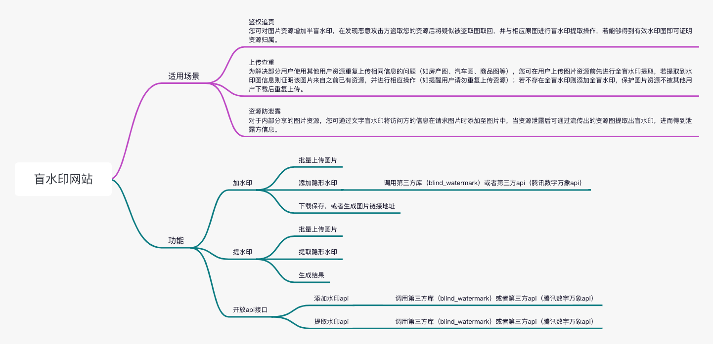

 
# digital-watermark 数字水印

#### 介绍

##### 适用场景

鉴权追责
您可对图片资源增加半盲水印，在发现恶意攻击方盗取您的资源后将疑似被盗取图取回，并与相应原图进行盲水印提取操作，若能够得到有效水印图即可证明资源归属。

上传查重
为解决部分用户使用其他用户资源重复上传相同信息的问题（如房产图、汽车图、商品图等），您可在用户上传图片资源前先进行全盲水印提取，若提取到水印图信息则证明该图片来自之前已有资源，并进行相应操作（如提醒用户请勿重复上传资源）；若不存在全盲水印则添加全盲水印，保护图片资源不被其他用户下载后重复上传。

资源防泄露
对于内部分享的图片资源，您可通过文字盲水印将访问方的信息在请求图片时添加至图片中，当资源泄露后可通过流传出的资源图提取出盲水印，进而得到泄露方信息。

#### 软件架构
软件架构说明

#### 安装教程

1.  xxxx
2.  xxxx
3.  xxxx

#### 使用说明

1.  xxxx
2.  xxxx
3.  xxxx

#### 参与贡献

1.  Fork 本仓库
2.  新建 Feat_xxx 分支
3.  提交代码
4.  新建 Pull Request

#### 特技

1.  使用 Readme\_XXX.md 来支持不同的语言，例如 Readme\_en.md, Readme\_zh.md
2.  Gitee 官方博客 [blog.gitee.com](https://blog.gitee.com)
3.  你可以 [https://gitee.com/explore](https://gitee.com/explore) 这个地址来了解 Gitee 上的优秀开源项目
4.  [GVP](https://gitee.com/gvp) 全称是 Gitee 最有价值开源项目，是综合评定出的优秀开源项目
5.  Gitee 官方提供的使用手册 [https://gitee.com/help](https://gitee.com/help)
6.  Gitee 封面人物是一档用来展示 Gitee 会员风采的栏目 [https://gitee.com/gitee-stars/](https://gitee.com/gitee-stars/)
